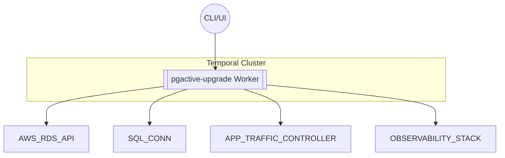

# PRD: Rolling Major-Version Upgrade with pgactive on Amazon RDS for PostgreSQL 🛠️

**Version**: 1.0  
**Date**: 2025-07-17  
**Owner**: SRE / DB Engineering  
**Stakeholders**: SREs, App Developers, Compliance

---

## 1. Executive Summary

Automate a rolling major‑version upgrade of Amazon RDS for PostgreSQL using **pgactive** orchestrated via an idiomatic **Temporal workflow** in **Go 1.24.5**, using `log/slog` and Go’s standard library. Achieves minimal downtime, safe rollbacks, observability, testability, and compliance.

---

## 2. Goals & Non‑Goals

### 🎯 Goals
- **G‑1**: Downtime < 60 s  
- **G‑2**: Single‑command, idempotent execution  
- **G‑3**: Rollback possible within < 30 s  
- **G‑4**: Full observability (structured logs, metrics, traces)  
- **G‑5**: Schema/table‑level replication support

### ❌ Non‑Goals
- **NG‑1**: Not using RDS Blue/Green managed upgrade  
- **NG‑2**: Not migrating existing logical subscribers

---

## 3. Personas

- **SRE / DB Engineer** – Executes, monitors, and rolls back  
- **App Developer** – Adjusts connection strings  
- **Compliance Auditor** – Reviews execution history/logs

---

## 4. Background & Context

- **pgactive** enables bidirectional logical replication for live upgrades  
- In-place upgrades cause unacceptable downtime  
- **Temporal** ensures durable, predictable orchestration with retries  
- **Go 1.24.5** + `log/slog` support structured logging and silent testing

---

## 5. Architecture Overview



---

## 6. Temporal Workflow Spec

### Workflow: `RollingUpgradeWorkflow`

| Step                       | Type                | ID Key            | Timeout    | Purpose                                     |
|---------------------------|---------------------|-------------------|------------|---------------------------------------------|
| ValidateInput              | Activity            | `db-id`           | 30 s       | Validate input parameters                   |
| ProvisionTargetDB          | Activity            | `target-db`       | 15 m       | Create new RDS instance                     |
| ConfigurePgactiveParams    | Activity            | `param-group`     | 5 m        | Enable pgactive via param group + reboot    |
| InstallPgactiveExtension   | Activity            | `install-ext`     | 3 m        | CREATE EXTENSION pgactive                   |
| InitReplicationGroup       | Child Workflow      | `replication-group` | 30 m    | Setup replication group                     |
| WaitForSync                | Activity w/ heartbeat | `wait-sync`     | 24 h       | Wait until replication lag = 0             |
| TrafficShiftPhase (loop)   | Activity            | `shift-<n>`       | 10 m/phase | Shift N% of traffic                         |
| RunHealthChecks            | Activity            | `hc-<n>`          | 5 m        | Validate system after shift                 |
| Cutover                    | Activity            | `cutover`         | 1 m        | Final traffic switch                        |
| OptionallyDetachOld        | Activity            | `detach`          | 5 m        | Remove old node from pgactive               |
| DecommissionSource         | Activity            | `delete-old`      | 10 m       | Delete old RDS instance                     |

#### Signals & Queries

- **`Rollback`**: Halts future steps, reverses traffic, maintains replication  
- **`Progress`**: Returns `{ phase, percent, replicationLagBytes }`

---

## 7. Activity Implementation Guidelines

- Use **AWS SDK v2** via `net/http`  
- Access DB with `database/sql` + `lib/pq`  
- Structured logging via `slog`  
- Use `context.Context`-aware logging from Temporal  
- Emit metrics via `slog.Int(...)` for integration  
- Example:

```go
func (a *Installer) ConfigurePgactiveParams(ctx context.Context, in ParamsInput) error {
    a.Log.Info("setting pgactive parameter", slog.String("db", in.DBInstanceID))
    _, err := a.RDS.ModifyDBParameterGroup(ctx, &rds.ModifyDBParameterGroupInput{...})
    return err
}
```

---

## 8. Failure Handling & Compensation

| Error Scenario                 | Handling                          | Mitigation Strategy                          |
|------------------------------|-----------------------------------|----------------------------------------------|
| DB creation fails            | Retry, then terminate workflow    | Clean fail                                    |
| Lag > threshold 15 min       | Signal escalate, pause shift      | Admin reviews, control manual restart         |
| Health check fails           | Run local rollback to last state  | Restore traffic pointers                      |
| pgactive conflict            | Panic workflow, await rollback    | Human intervention required                   |

- Use `ContinueAsNew` to manage history size  
- Use AWS IAM roles/Secrets Manager for credentials

---

## 9. Requirements

### Functional
1. Accept inputs: source ARN, target version, subnets, shift percentages, filters  
2. Support selective schema/table-level replication  
3. Provide <1s progress queries  
4. Emit <500B JSON logs per event  
5. Unit tests: happy path, mid-phase rollback, idempotency

### Non‑Functional
- Resilient: survive worker restarts  
- Secure: IAM roles, secrets in Temporal Search Attributes  
- Observable: OpenTelemetry interceptors + metrics  
- Configurable: instance class defaults to source’s  
- Compliant: ≥ 90 days history, KMS encryption for logs

---

## 10. Timeline & Milestones

| Week | Milestone                                   |
|------|---------------------------------------------|
| 0    | Repo scaffold, CI/CD with Go 1.24.5        |
| 2    | MVP Activities implemented                  |
| 4    | Full Workflow + Dev integration testing     |
| 5    | Performance/load testing on sample data     |
| 6    | Observability + alerting setup              |
| 7    | Production pilot deployment                 |
| 8    | General availability                        |

---

## 11. Risks & Mitigations

- **Sequence values not replicated**: sync sequences pre-cutover  
- **Tables without PK**: detect + block until fixed  
- **Large transactions**: enforce `max_logical_replication_message_size`

---

## 12. Appendix

### A: Go Module

```go
module company.com/infra/pgactive-upgrade

require (
  go.temporal.io/sdk v1.x
  github.com/aws/aws-sdk-go-v2 v1.x
  github.com/lib/pq v1.x
  go.opentelemetry.io/otel v1.x
)
```

### B: slog Setup

```go
handler := slog.NewJSONHandler(os.Stdout, &slog.HandlerOptions{
  AddSource: true,
})
slog.SetDefault(slog.New(handler))
```

---

## 13. References
- AWS Blog: pgactive rolling major‑version upgrade  
- AWS Docs: pgactive extension and replication group  
- AWS Docs: enabling pgactive, extension setup  
- PostgreSQL docs: logical replication fundamentals  
- Go 1.24 Release Notes (`log/slog`)  
- Temporal Go SDK: logging and telemetry integration

---

*Markdown file ready for agent ingestion — save as `PRD.md` for implementation.*

