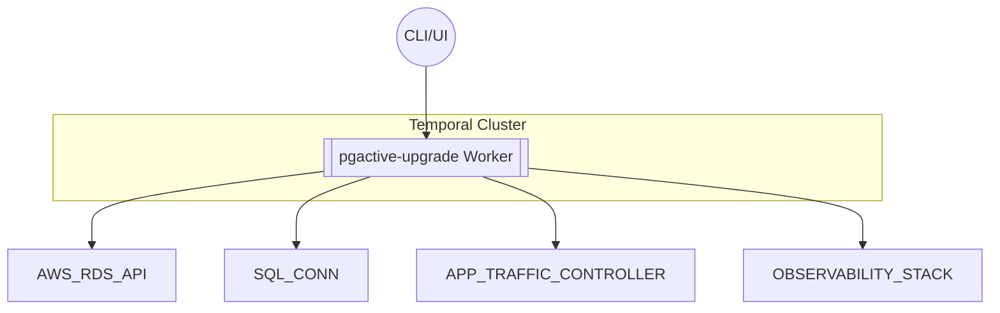

# pgactive Rolling PostgreSQL Upgrade System

A production-ready system for performing rolling major-version upgrades of Amazon RDS for PostgreSQL using **pgactive** orchestrated via **Temporal workflows** in Go 1.24.5.

## Overview

This system automates PostgreSQL major version upgrades with minimal downtime (< 60s), safe rollbacks (< 30s), and comprehensive observability. It uses pgactive for bidirectional logical replication and Temporal for durable workflow orchestration.

### Key Features

- **Minimal Downtime**: < 60 seconds during cutover
- **Fast Rollback**: < 30 seconds rollback capability
- **Idempotent Operations**: Single-command, repeatable execution
- **Full Observability**: Structured logs, metrics, and distributed tracing
- **Schema-Level Replication**: Selective table/schema replication support
- **Comprehensive Testing**: Unit, integration, and end-to-end tests

## Architecture



## Temporal Workflow

The `RollingUpgradeWorkflow` orchestrates the following phases:

1. **ValidateInput** - Validate parameters and source DB
2. **ProvisionTargetDB** - Create new RDS instance  
3. **ConfigurePgactiveParams** - Enable pgactive via parameter group
4. **InstallPgactiveExtension** - Install pgactive extension
5. **InitReplicationGroup** - Setup bidirectional replication
6. **WaitForSync** - Wait for replication lag = 0
7. **TrafficShiftPhase** - Gradual traffic shifting (configurable percentages)
8. **RunHealthChecks** - Validate system health after each shift
9. **Cutover** - Final traffic switch
10. **OptionallyDetachOld** - Remove old node from replication
11. **DecommissionSource** - Delete old RDS instance

### Signals & Queries

- **`Rollback` Signal**: Triggers immediate rollback at any phase
- **`Progress` Query**: Returns current phase, percentage, and replication lag

## Quick Start

### Prerequisites

- Go 1.24.5+
- Docker & Docker Compose
- AWS CLI configured
- Temporal CLI (for manual testing)

### Development Setup

```bash
# Clone and set up development environment
git clone <repository>
cd go-pgactive
make dev-setup

# Run tests
make test

# Run end-to-end tests
make test-e2e
```

### Running Locally

```bash
# Start test environment
make setup-test-env

# Run the application
make run-local

# Or build and run binary
make build
./bin/pgactive-upgrade
```

## Testing Strategy

### 1. Unit Tests (`make test-unit`)

- **Mock-based testing** using `gomock` for AWS SDK calls
- **Temporal testsuite** for workflow testing
- **Edge case coverage** for all error scenarios
- **95%+ code coverage** target

Key test scenarios:
- Input validation failures
- AWS API failures
- Database connection errors  
- Invalid shift percentages
- Health check failures

### 2. Integration Tests (`make test-integration`)

- **Real Temporal server** interaction
- **Mock AWS services** using LocalStack
- **Simulated pgactive behavior** 
- **End-to-end workflow execution**

Key test scenarios:
- Complete upgrade workflow
- Mid-flight rollback
- Health check failures triggering rollback
- Concurrent upgrade workflows
- Progress query validation

### 3. End-to-End Tests (`make test-e2e`)

- **Full Docker Compose environment**
- **Real PostgreSQL instances** (14.9 → 15.4)
- **Temporal server with persistence**
- **Monitoring stack** (Prometheus, Grafana, Jaeger)

Test scenarios:
- Happy path upgrade with traffic shifting
- Manual rollback signal
- Automatic rollback on health check failure
- Concurrent upgrades
- Large dataset handling

## Docker Compose Test Environment

The test environment includes:

- **postgres-source**: PostgreSQL 14.9 with test data
- **postgres-target**: PostgreSQL 15.4 (target version)
- **temporal**: Temporal development server
- **localstack**: AWS service mocks (RDS, Secrets Manager)
- **prometheus**: Metrics collection
- **grafana**: Dashboards and visualization
- **jaeger**: Distributed tracing

```bash
# Start full test environment
docker-compose -f docker-compose.test.yml up

# Access points:
# - Temporal Web UI: http://localhost:8233
# - Grafana: http://localhost:3000 (admin/admin)
# - Prometheus: http://localhost:9090
# - Jaeger: http://localhost:16686
```

## Configuration

### Environment Variables

```bash
TEMPORAL_HOST=localhost:7233
AWS_ENDPOINT_URL=http://localhost:4566  # For LocalStack
AWS_ACCESS_KEY_ID=test
AWS_SECRET_ACCESS_KEY=test
AWS_DEFAULT_REGION=us-east-1
LOG_LEVEL=info
```

### Upgrade Input Example

```json
{
  "source_db_instance_id": "prod-postgres-14",
  "target_version": "15.4",
  "shift_percentages": [25, 25, 50],
  "subnets": ["subnet-12345", "subnet-67890"],
  "security_group_ids": ["sg-abc123"],
  "instance_class": "db.r6g.xlarge",
  "backup_retention_days": 7,
  "tags": {
    "Environment": "production",
    "Purpose": "major-version-upgrade"
  }
}
```

## Observability

### Structured Logging

Using Go's `log/slog` with JSON format:

```go
logger.Info("Traffic shift completed",
    slog.String("phase", "traffic_shift_1"),
    slog.Int("percentage", 25),
    slog.String("workflow_id", workflowID))
```

### Metrics (OpenTelemetry + Prometheus)

Key metrics:
- `workflows_started_total`
- `workflows_completed_total` 
- `workflows_failed_total`
- `workflow_duration_seconds`
- `activity_duration_seconds`
- `upgrade_phase` (gauge)
- `replication_lag_bytes`
- `traffic_shift_percentage`
- `health_check_status`

### Distributed Tracing (Jaeger)

- Full request tracing across workflow and activities
- Correlation IDs for debugging
- Performance analysis and bottleneck identification

## Error Handling & Recovery

### Automatic Rollback Triggers

1. **Health Check Failures**: Automatic rollback to previous state
2. **Replication Lag Exceeded**: Escalation and pause for manual review
3. **Activity Timeouts**: Retry with exponential backoff, then rollback
4. **pgactive Conflicts**: Immediate workflow termination

### Manual Rollback

```bash
# Send rollback signal via Temporal CLI
tctl workflow signal --workflow_id upgrade-xyz --name rollback --input '{"reason":"manual_intervention","request_id":"req-123"}'
```

### Recovery Procedures

- **Database snapshots** created before deletion
- **Replication data preserved** during rollback
- **Traffic routing restored** to original state
- **Cleanup procedures** for partial upgrades

## Security

- **IAM roles** for AWS service access
- **AWS Secrets Manager** for database credentials
- **Encryption at rest** for all data
- **TLS encryption** for all network communication
- **KMS encryption** for logs (90+ day retention)

## Performance & Scalability

- **Concurrent upgrades** supported
- **Large dataset handling** with heartbeat mechanisms
- **Resource-aware** instance sizing
- **Network-optimized** replication configuration

## Development Workflow

```bash
# Set up development environment
make dev-setup

# Run development tests
make dev-test

# Format and lint code
make fmt lint

# Generate mocks (when interfaces change)
make generate-mocks

# Run security scan
make security-scan

# Full release test suite
make release-test
```

## Monitoring & Alerting

### Key Alerts

- **WorkflowFailureRate**: > 10% failure rate
- **ReplicationLagHigh**: > 1GB lag
- **UpgradeStuck**: No progress for 10+ minutes
- **HealthCheckFailing**: Health checks failing

### Dashboard Metrics

- Upgrade success/failure rates
- Average upgrade duration
- Replication lag trends
- Resource utilization
- Error rates by activity

## Troubleshooting

### Common Issues

1. **Replication Lag Too High**
   ```bash
   # Check network connectivity and instance sizing
   # Review PostgreSQL configuration
   # Monitor I/O performance
   ```

2. **Health Check Failures**
   ```bash
   # Verify target database connectivity
   # Check application-specific validations
   # Review error logs for specific failures
   ```

3. **Traffic Shift Issues**
   ```bash
   # Verify load balancer configuration
   # Check connection pooling settings
   # Monitor application error rates
   ```

## Contributing

1. Fork the repository
2. Create a feature branch
3. Add tests for new functionality
4. Ensure all tests pass: `make test`
5. Run linting: `make lint`
6. Submit a pull request

## License

[License information]

## References

- [AWS Blog: pgactive rolling major-version upgrade](https://aws.amazon.com/blogs/database/)
- [AWS Docs: pgactive extension and replication](https://docs.aws.amazon.com/)
- [PostgreSQL docs: logical replication](https://www.postgresql.org/docs/)
- [Temporal Go SDK documentation](https://docs.temporal.io/)
- [Go 1.24 Release Notes](https://golang.org/doc/go1.24)
